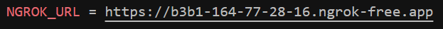

# DEMO Entrega 2.1:
https://youtu.be/EoQIT4K8740

# DEMO Entrega 2.2:
https://youtu.be/Eb0xCYOWUpI

Por favor, ejecutar `bin/rails db:drop db:create db:migrate db:seed`, asegurarse de que `backend/public/event_images` y `backend/public/videos` estén vacíos y que las imágenes subidas sean `jpg`. 

Además, en caso de error por el `proyect_id` de Expo usar:

    - username: franco17
    - password: wixjyt-3vYcma-zyjxuv

# DEMO Entrega 2.3:
[https://youtu.be/Eb0xCYOWUpI
](https://www.youtube.com/watch?v=kTS3v43xYfM&ab_channel=FRANCOPAOLOPALAVICINOGONZALEZ)

Para esta entrega es relevante que en el método `url` del archivo `backend/event_picture.rb` se ponga la IP local con la que se accede al backend.
```
  def url
    picture.attached? ? Rails.application.routes.url_helpers.rails_blob_url(picture, host: 'http://192.168.1.83:3001') : nil # Usar IP local
  end 
```
En caso de usar NGROK, basta con poner el mismo valor que toma la variable `NGROK_URL` en `hybrid-frontend/.env` (más información abajo en "WINDOWS/WSL"). 

# Apple OS
### Modificar las rutas de la API para pruebas con iOS Bundled:
##### En hybrid-frontend/app/beers/BeersIndex.jsx  y hybrid-frontend/app/beers/BeerShow.jsx
* Modificarn en las llamada a la API: 'http://192.168.1.89:3001" por 'http://<LOCAL_IP>:3001" 
##### Lo mismo en hybrid-frontend/app/login.jsx , hybrid-frontend/app/logout.jsx , hybrid-frontend/app/Signup.jsx

## En hybrid-frontend:
* 1. Dependencias: npm install
* 2. Iniciar Expo: npx expo start --clear   

## En backend:
* 1. Dependencias: bundle install
* 2. Base de datos: rails db:create db:migrate db:seed
* 3. Iniciar servidor: rails server -b 0.0.0.0 -p 3001


# WINDOWS/WSL
Las pruebas con **WSL** se están realizando mediante **NGROK**. Para establecer una conexión, simplemente basta con ejecutar `ngrok http 3001` y agregar/cambiar el valor de la variable `NGROK_URL` en el archivo `.env` presente en `hybrid-frontend`. `NGROK_URL` debe tener asociado el valor que genera NGROK en `Forwarding`, tal y como se ve en las imágenes.




